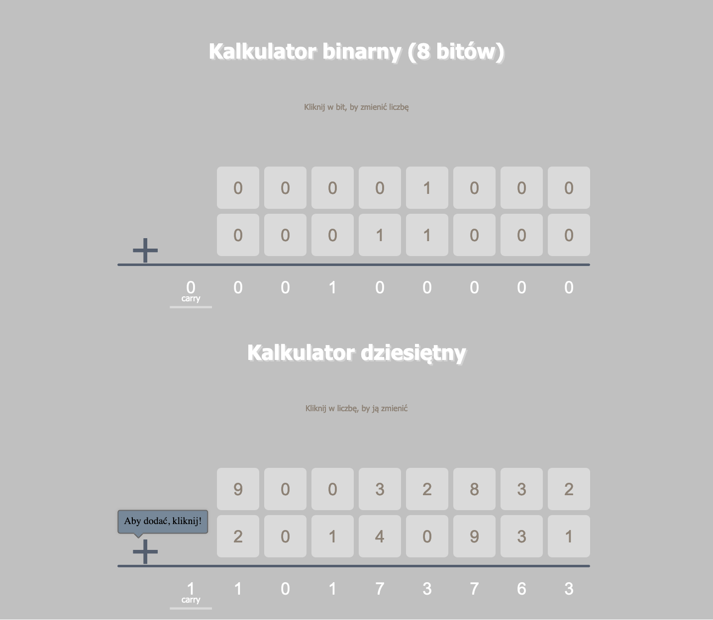

# Binary-and-decimal-calculator

## Live demo

[https://lukaszkopyto.github.io/Binary-and-decimal-calculator/
](https://lukaszkopyto.github.io/Binary-and-decimal-calculator/)

## Table of contents

- [General info](#general-info)
- [Screenshots](#screenshots)
- [Technologies](#technologies)
- [Usage](#usage)

## General info

> Preparation of two calculators in JS ES6 as part of the CodersLab workshop.

The first is a binary calculator, the second is a decimal calculator.

## Screenshots

## Technologies

- Javascript ES6
- jQuery
- Webpack
- Sass
- HTML

## Usage

After you clone this repo to your desktop, go to its root directory and run `npm install` to install its dependencies.

Once the dependencies are installed, you can run `npm run start` to start webpack dev server. You will then be able to access it at localhost:3001.

Or you can run `npm run start:prod` to creating a bundle.
